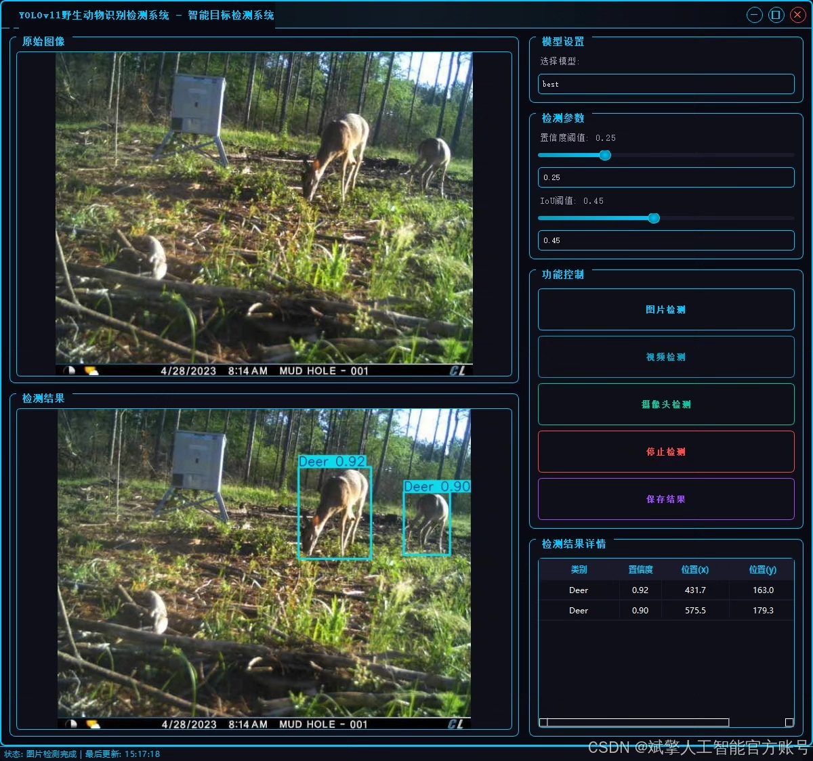
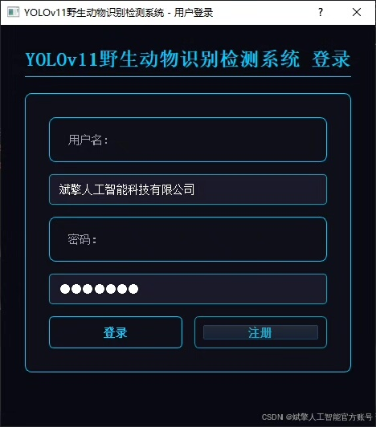
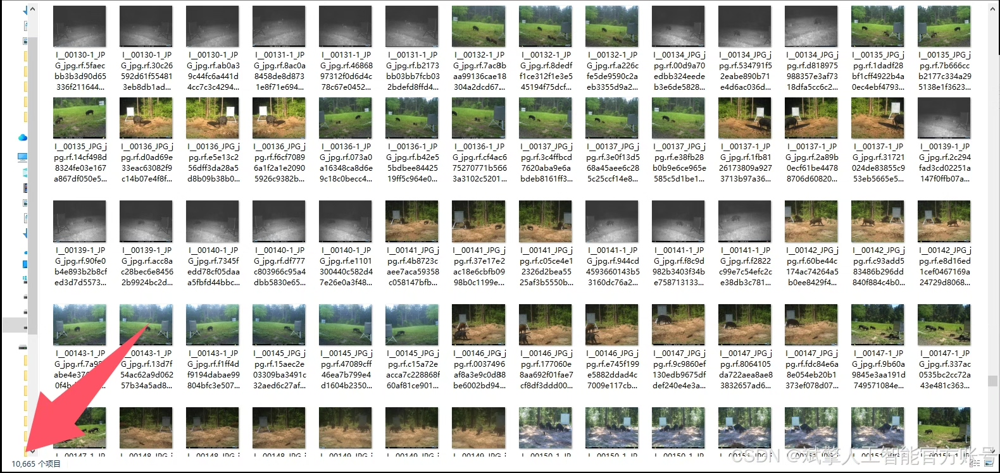
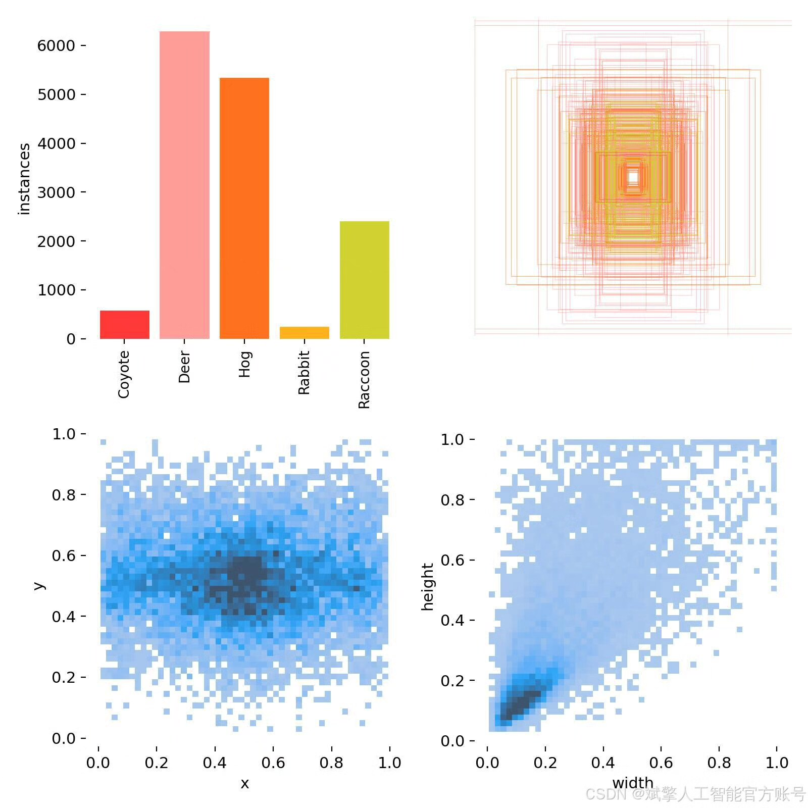
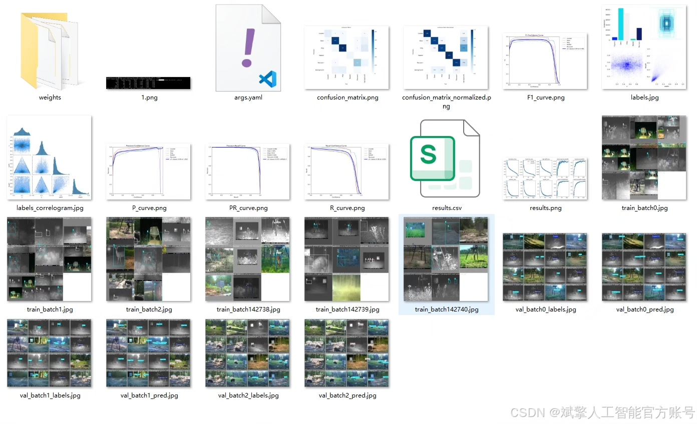
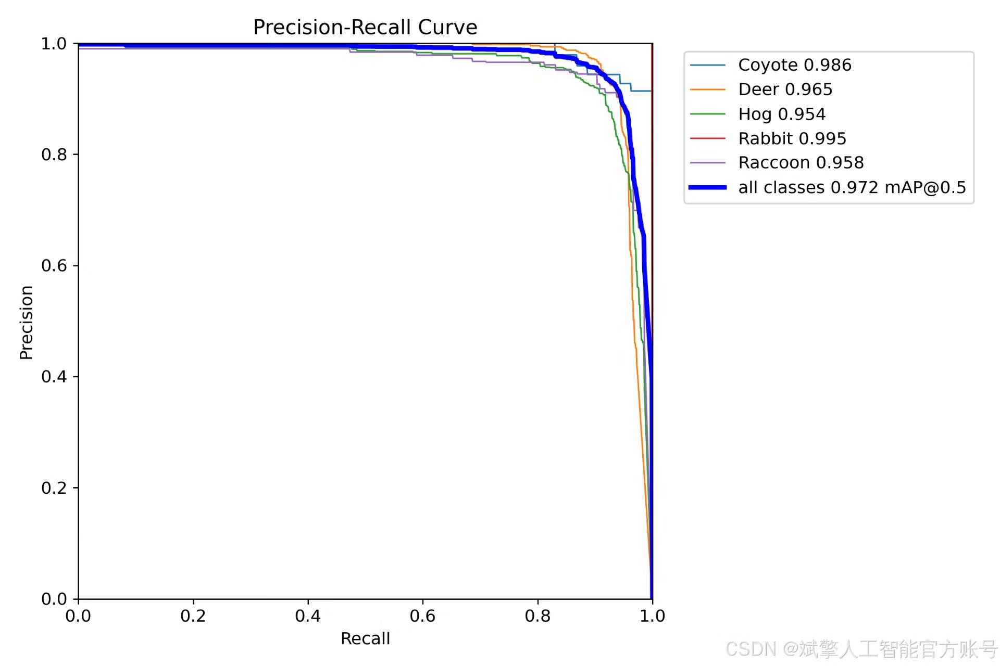
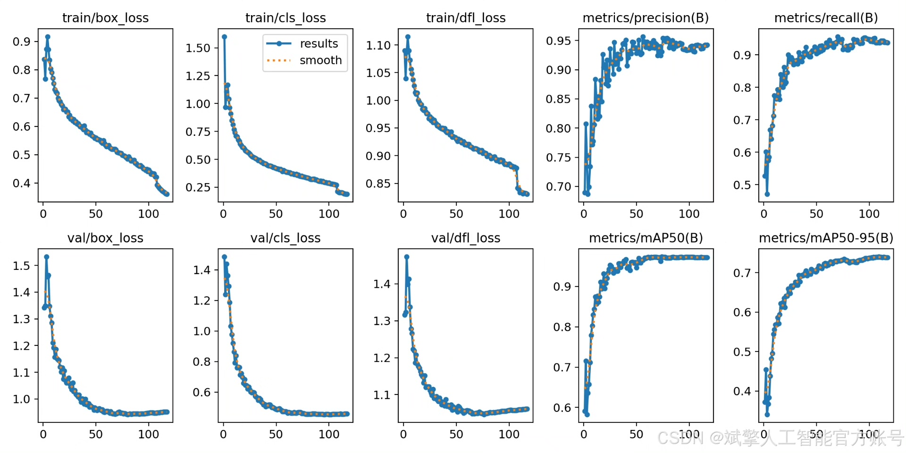
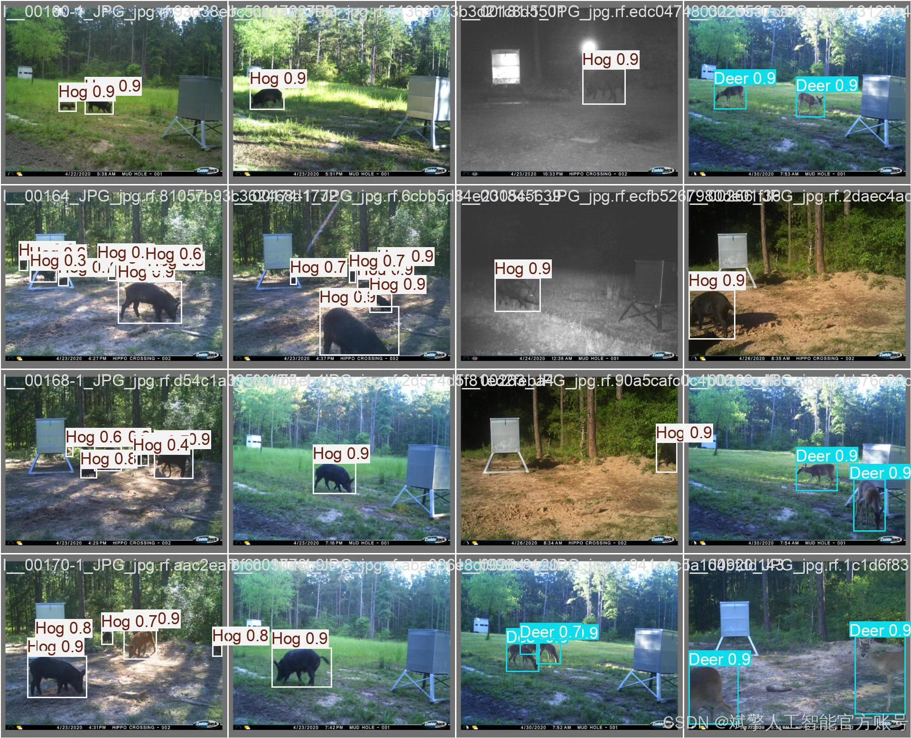
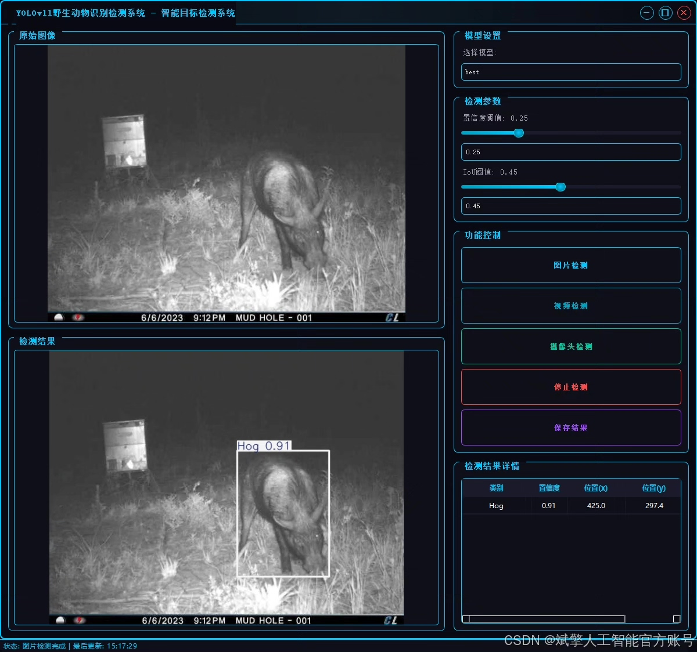

# YOLOv11 Wildlife Detection System

## Body

YOLOv11 Wildlife Detection System Based on Deep Learning YOLOv11: A Wildlife Detection and Detection System (YOLOv11+YOLO dataset + UI interface + login registration interface + Python project source code + model)

This paper designs and implements an efficient wildlife detection system based on the YOLOv11 deep learning algorithm, aiming to solve the problem of real-time animal detection in nature reserves and wild monitoring scenarios. The system supports precise recognition of five common wildlife species (coyote, deer, boar, rabbit, raccoon), using a self-built YOLO format dataset (including 10,665 training images, 928 validation images, and 536 test images). By combining a user-friendly UI interface and login registration functions, the system realizes a full-process closed loop from data labeling, model training to practical application. Experiments show that the system achieves high detection accuracy and real-time performance on the test set, providing an intelligent solution for ecological monitoring and biodiversity protection. The code is implemented in Python, facilitating further research and expansion.

Dataset:
nc: 5
names: ['Coyote', 'Deer', 'Hog', 'Rabbit', 'Raccoon'],
dataset quantity: 10665 training images, 928 validation images, 536 test images.

✅ User login registration: Supports password verification and security validation.
✅ Three detection modes: Based on the YOLOv11 model, supports image, video, and real-time camera detection, with precise target recognition.
✅ Dual-screen comparison: Display original images and detection results on the same screen.
✅ Data visualization: Real-time table displaying the category, confidence, and coordinates of detected targets.
✅ Intelligent parameter adjustment: Offers a confidence slide bar, dynamically optimizing detection accuracy to meet different scene needs.
✅ Sci-fi style interactive interface: Dark theme combined with dynamic light effects, reducing visual fatigue and improving operational experience.

## Images

## Payment

Here is a pay link on Stripe ( https://buy.stripe.com/3cs8yP7sY87d0vu9AB ). Please contact me lonlonago@foxmail.com after funding $89, and I will send you a complete data files , thank you!

